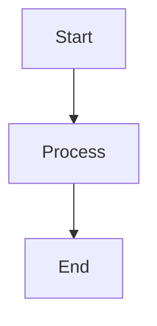

# Napramak Documentation

This repository contains the official documentation for the **Napramak Logistics Platform**, a comprehensive system
designed to streamline supply chain operations, shipment tracking, and organizational management.

The documentation is built using [MkDocs](https://www.mkdocs.org/) with
the [Material theme](https://squidfunk.github.io/mkdocs-material/) and automatically deployed to GitHub Pages.

## Quick Start

### Prerequisites

- Python 3.11 or higher
- [Task](https://taskfile.dev/) task runner
- [uv](https://docs.astral.sh/uv/) Python package manager

### Installation

Install all development tools automatically:

```bash
task dev:install
```

This will install Homebrew (if needed), Python, uv, and other required dependencies.

### View Documentation Locally

Start the development server with live reload:

```bash
task docs:serve
```

The documentation will be available at [http://127.0.0.1:8000](http://127.0.0.1:8000)

## Available Commands

| Command           | Description                               |
|-------------------|-------------------------------------------|
| `task`            | List all available tasks                  |
| `task docs:serve` | Start development server with live reload |
| `task docs:build` | Build static documentation site           |
| `task docs:clean` | Clean generated documentation files       |

## Project Structure

```
.
├── docs/                  # Documentation source files
│   ├── index.md           # Homepage
│   ├── api/               # API documentation
│   │   ├── rest_api.md    # REST API page with Swagger UI
│   │   └── swagger.json   # OpenAPI specification (auto-generated)
│   └── project_info.yml   # Project metadata for templates
├── mkdocs.yml             # MkDocs configuration
├── Taskfile.yaml          # Task runner commands
├── pyproject.toml         # Python dependencies
└── .github/workflows/     # CI/CD workflows
```

## Documentation Features

- **Material Design Theme** with light/dark mode support
- **Live Search** with highlighting
- **Interactive API Documentation** using Swagger UI
- **Mermaid Diagrams** support in code blocks
- **Responsive Design** optimized for all devices
- **Code Syntax Highlighting** with copy buttons

## Development Workflow

1. **Edit Documentation**: Modify Markdown files in the `docs/` directory
2. **Preview Changes**: Run `task docs:serve` to see changes in real-time
3. **Commit Changes**: Follow standard Git workflow
4. **Automatic Deployment**: Push to `master` branch triggers automatic deployment to GitHub Pages

## CI/CD

Documentation is automatically built and deployed via GitHub Actions:

- **Build**: Runs on all pushes and pull requests to validate documentation
- **Deploy**: Deploys to GitHub Pages on pushes to `master` branch

## Writing Documentation

### Using Template Variables

The documentation supports Jinja2 template variables defined in `docs/project_info.yml`:

```markdown
Welcome to {{ project.name }}!
```

### Embedding API Documentation

Use the Swagger UI tag to embed interactive API documentation:

```markdown
<swagger-ui src="./swagger.json"/>
```

### Creating Diagrams

Use Mermaid syntax in code blocks:

````markdown

````

## Contributing

1. Fork the repository
2. Create a feature branch (`git checkout -b feature/amazing-docs`)
3. Make your changes
4. Test locally with `task docs:serve`
5. Commit your changes (`git commit -m 'Add amazing documentation'`)
6. Push to the branch (`git push origin feature/amazing-docs`)
7. Open a Pull Request

## License

Copyright © 2024-2025 Napramak Team

## Links

- [Published Documentation](https://napramak.github.io/documentation/)
- [MkDocs Documentation](https://www.mkdocs.org/)
- [Material for MkDocs](https://squidfunk.github.io/mkdocs-material/)
